# 🧪 Agnel Arena — E2E Minute-to-Minute Testing Documentation

> **Branch:** `refund-init`  
> **Target Environment:** Local Docker (`http://localhost:3001`) / Production (`147.93.104.183`)  
> **Associated CSV:** [`E2E_MINUTE_TO_MINUTE_TESTING_SUITE.csv`](file:///C:/Projects/futsal-laravel/E2E_MINUTE_TO_MINUTE_TESTING_SUITE.csv)

---

## 📌 Executive Summary & Key Business Rules

### 1. Refund & Cancellation Rules
- **Customer Self-Cancellation ($\ge 3$ Hours Prior):**
  - Cancellations made at least 3 hours prior to slot time are eligible for a refund.
  - A **5% service fee** is automatically deducted from the refundable amount.
- **Customer Self-Cancellation ($< 3$ Hours Prior):**
  - Strictly **no refunds** for cancellations made less than 3 hours before slot time.
- **Super Admin Force Refund (Bypass Rule):**
  - Super Admins can bypass all time restrictions and issue a refund at any point.
  - A **5% handling fee** is deducted from the refundable amount.
  - Full audit logging is recorded (`FORCE_REFUND`).
- **Arena Admin Refund Restriction:**
  - Arena Admins **cannot** process refunds (`POST /api/fg-admin/arena/refund` returns `HTTP 403 Forbidden`).
  - Arena Admins **can reschedule** any booked appointment to an available slot.

### 2. Multi-Slot Combined Booking Rules
- Combined multi-slot bookings (multiple slots under 1 `booking_ref`) are rendered as **grouped cards**.
- In the Super Admin Force Refund modal:
  - Each slot is listed individually (e.g. ① `06:00 - 07:00`, ② `07:00 - 08:00`).
  - Per-slot financial breakdown: Gross Amount, 5% Handling Fee, and Net Slot Refund.
  - Combined Total Gross, Combined 5% Fee, and Final Net Refund are displayed at the bottom.

### 3. Payment Method Restrictions (PayU API Enforce)
- Permitted payment methods passed via `enforce_paymethod=UPI|DC|CASH|NB`:
  - ✅ **UPI** (Standard UPI only, Credit on UPI blocked)
  - ✅ **Debit Card** (`DC`)
  - ✅ **Wallets / Cash Cards** (`CASH`)
  - ✅ **Net Banking** (`NB`)
  - ❌ **Credit Cards** (`CC` — excluded)

---

## 🔀 System Workflow Architecture

```mermaid
flowchart TD
    subgraph Customer_Portal ["Customer Portal (Public)"]
        A[1. Mobile OTP Request & Login] --> B[2. Select Slot / Multi-Slot]
        B --> C[3. PayU Checkout Form: Enforce UPI/DC/CASH/NB]
        C --> D[4. Payment Success -> Ticket & QR Code]
        D --> E1{5. Cancellation Request}
        E1 -->|>= 3 Hours| F1[Eligible: Refund minus 5% fee]
        E1 -->|< 3 Hours| F2[Blocked: No Refund]
    end

    subgraph Arena_Admin ["Arena Admin Portal"]
        G[1. Admin Auth] --> H[2. View Grouped Bookings]
        H --> I[3. Reschedule Slot / Date]
        H --> J[4. Attempt Refund -> 403 Forbidden]
    end

    subgraph Super_Admin ["Super Admin Master Portal"]
        K[1. Super Admin Auth] --> L[2. Direct System Slot Block]
        K --> M[3. View Multi-Slot Grouped Bookings]
        M --> N[4. Force Refund Modal]
        N --> O[Per-Slot Breakdown & 5% Fee Calculation]
        O --> P[5. Audit Log Entry Created]
    end

    subgraph Security_Gate ["Security Desk"]
        Q[1. Security Login] --> R[2. Scan QR / Search Ticket ID]
        R --> S[3. Validate & Check-in User]
    end
```



---

## ⏱️ Minute-to-Minute Test Execution Specification

### Phase 1: Customer Success / Public Flow

| Test ID | Minute | Step / Action | Input Data / Params | Expected Result | Status |
| :--- | :---: | :--- | :--- | :--- | :---: |
| **CS-001** | `00:00` | Request login OTP | Mobile: `9876543210` | 6-digit OTP code dispatched to mobile/log | `PASS` |
| **CS-002** | `00:01` | Submit OTP verification | OTP: `123456` | Auth session created; redirected to `/dashboard` | `PASS` |
| **CS-003** | `00:03` | Select single slot on arena page | Slot: `06:00 - 07:00` | Slot locked; price displayed correctly | `PASS` |
| **CS-004** | `00:05` | Select multiple slots for combined booking | Slots: `07:00-08:00`, `08:00-09:00` | Single combined `booking_ref` generated; total amount summed | `PASS` |
| **CS-005** | `00:07` | Inspect PayU checkout POST form | PayU parameters | `enforce_paymethod=UPI\|DC\|CASH\|NB` present; Credit Card blocked | `PASS` |
| **CS-006** | `00:09` | Complete payment callback | Status: `SUCCESS` | Redirected to `/booking/success/[ref]` with QR & Ticket ID | `PASS` |
| **CS-007** | `00:11` | View customer dashboard | Session user | Confirmed bookings display `VIEW TICKET` & green status pill | `PASS` |
| **CS-008** | `00:13` | Cancel booking $\ge 3\text{h}$ before game | Booking Ref | Cancel request submitted; 5% fee calculated, refund pending | `PASS` |
| **CS-009** | `00:15` | Cancel booking $< 3\text{h}$ before game | Booking Ref | Blocked with error: "Cancellations only allowed $\ge 3\text{h}$ prior" | `PASS` |
| **CS-010** | `00:17` | Access failed/expired payment URL | Booking Ref (failed) | Red `PAYMENT FAILED` pill shown; ticket page access blocked | `PASS` |

---

### Phase 2: Arena Admin Flow

| Test ID | Minute | Step / Action | Input Data / Params | Expected Result | Status |
| :--- | :---: | :--- | :--- | :--- | :---: |
| **AA-001** | `00:20` | Arena Admin login | `arena@test.com` / `SuperAdmin@123` | Authenticated to Arena Admin Dashboard | `PASS` |
| **AA-002** | `00:22` | View arena bookings list | Arena Context ID | Bookings grouped by `booking_ref` with sub-slot list | `PASS` |
| **AA-003** | `00:25` | Reschedule booking appointment | New Date & New Slot | Slot collision checked; booking updated to new date/time | `PASS` |
| **AA-004** | `00:27` | Attempt to process refund via API | POST `/api/fg-admin/arena/refund` | `HTTP 403 Forbidden` returned ("Arena Admins cannot refund") | `PASS` |

---

### Phase 3: Super Admin Flow

| Test ID | Minute | Step / Action | Input Data / Params | Expected Result | Status |
| :--- | :---: | :--- | :--- | :--- | :---: |
| **SA-001** | `00:30` | Super Admin login | `superadmin@agnelarenagoa.com` | Access granted to Master Super Admin Dashboard | `PASS` |
| **SA-002** | `00:32` | Direct system slot block | Date, Arena ID, Time Slot | Slot locked website-wide immediately with `free_booking` flag | `PASS` |
| **SA-003** | `00:35` | View platform bookings | Platform Context | Combined bookings rendered as single cards with numbered slots | `PASS` |
| **SA-004** | `00:38` | Force refund single-slot booking | Single Slot Ref | Time rule bypassed; gross minus 5% fee calculated & refunded | `PASS` |
| **SA-005** | `00:41` | Force refund multi-slot combined booking | Multi-Slot Ref (2+ Slots) | Renders per-slot breakdown (Slot 1, Slot 2) with 5% fee per slot & net total | `PASS` |
| **SA-006** | `00:45` | Inspect platform audit log | Action: `FORCE_REFUND` | Log entry verified with IP, User Agent, Ref, Gross, Fee, Net Refund | `PASS` |

---

### Phase 4: Security Staff Flow

| Test ID | Minute | Step / Action | Input Data / Params | Expected Result | Status |
| :--- | :---: | :--- | :--- | :--- | :---: |
| **SEC-001** | `00:48` | Security Staff login | `security@test.com` / `SuperAdmin@123` | Redirected to Security Portal `/fg-admin/security/scan` | `PASS` |
| **SEC-002** | `00:50` | Scan QR code / enter Ticket ID | Ticket: `TKT-AGN-XXXX` | Ticket validated; customer & slot details shown; `checked_in = true` | `PASS` |

---

## 🧮 Multi-Slot Financial Breakdown Formula

For a combined booking containing $n$ slots:

$$\text{Gross Amount}_{\text{Total}} = \sum_{i=1}^{n} \text{Slot Amount}_i$$

$$\text{Handling Fee}_i = \text{ROUND}\left(\text{Slot Amount}_i \times 0.05, 2\right)$$

$$\text{Net Slot Refund}_i = \text{Slot Amount}_i - \text{Handling Fee}_i$$

$$\text{Total Refund} = \sum_{i=1}^{n} \text{Net Slot Refund}_i$$

### Multi-Slot Modal UI Layout (Super Admin)
```text
┌─────────────────────────────────────────────────────────────┐
│ SUPER ADMIN REFUND — Combined Booking (2 Slots)             │
├─────────────────────────────────────────────────────────────┤
│ Slot Breakdown                                              │
│ ① 06:00 - 07:00          ₹500.00 − ₹25.00  = ₹475.00       │
│ ② 07:00 - 08:00          ₹500.00 − ₹25.00  = ₹475.00       │
├─────────────────────────────────────────────────────────────┤
│ Total Gross Amount:                               ₹1,000.00 │
│ Handling Fee (5%):                                 − ₹50.00 │
│ Total Net Refund:                                   ₹950.00 │
└─────────────────────────────────────────────────────────────┘
```

---

## 🔐 Role-Based Access Control (RBAC) Matrix

| Feature / Action | Customer | Arena Admin | Super Admin | Security Staff |
| :--- | :---: | :---: | :---: | :---: |
| Browse Arenas & Slots | ✅ | ✅ | ✅ | ❌ |
| Create Online Booking | ✅ | ❌ | ✅ (Free Block) | ❌ |
| Self-Cancel ($\ge 3\text{h}$) | ✅ | ❌ | ❌ | ❌ |
| Reschedule Appointment | ❌ | ✅ | ✅ | ❌ |
| Process Standard Refund | ❌ | ❌ (403 Blocked) | ✅ (Force Refund) | ❌ |
| Direct System Slot Block | ❌ | ❌ | ✅ | ❌ |
| Validate Ticket / Check-in | ❌ | ✅ | ✅ | ✅ |
| View System Audit Logs | ❌ | ❌ | ✅ | ❌ |

---

## 🚀 Verification & Execution Commands

```bash
# 1. Switch to testing branch
git checkout refund-init

# 2. Run TypeScript compilation check
npx tsc --noEmit

# 3. Build & spin up local Docker testing container
docker compose build app
docker compose up -d app

# 4. Check app readiness
docker compose logs --tail=20 app
```
